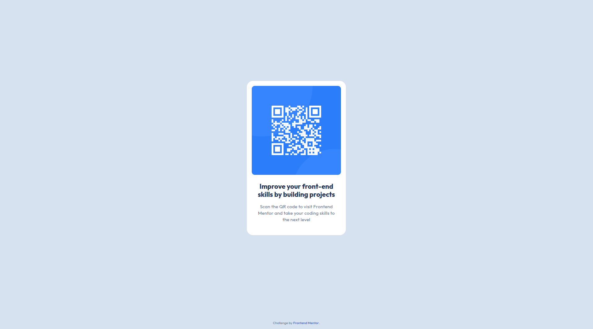

# QR Code Component — Frontend Mentor Solution

Solution to the Frontend Mentor challenge: "QR code component"  
Challenge URL: https://www.frontendmentor.io/challenges/qr-code-component-iux_sIO_H

## Overview

A small, responsive card that displays a QR code image with a title, description and attribution. Built with semantic HTML and CSS (mobile-first).

### Screenshot

### Live site

- Live: (add your live URL or GitHub Pages link)

## Built with

- HTML5
- CSS3 (custom properties, Flexbox, Grid)
- Google Fonts — Outfit

## What I learned

- Centering content with flexbox and keeping footer-like attribution pinned to the bottom using `flex-direction: column` + `margin: auto`.
- Creating a compact, accessible card layout and responsive image handling.

## Useful resources

- Frontend Mentor challenge — https://www.frontendmentor.io/
- A small guide on centering with Flexbox — https://css-tricks.com/centering-css-complete-guide/

## Acknowledgments

- Thanks to Frontend Mentor for the challenge and design brief.
